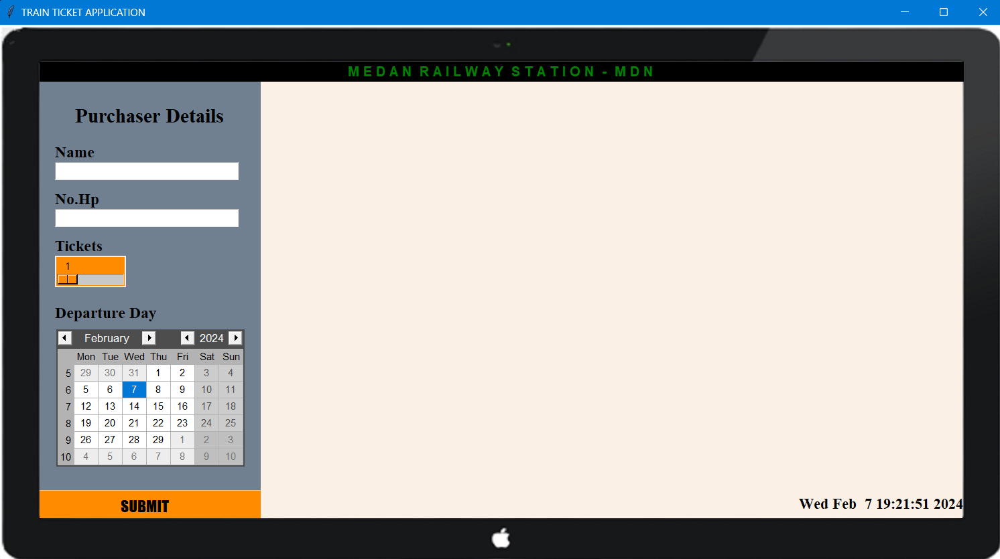

# Train Ticket Application

## MDN Railway Station

MDN Railway Station merupakan aplikasi pemesanan tiket kereta api

</a>

## Features

- Buyer Details (Name, Phone Number, Ticket, Departure Day)
- Destinations
- Train Options
- Payment
- Alerts

## Tech

Aplikasi ini dirancang menggunakan:

- [Visual Studio Code](https://code.visualstudio.com/docs/editor/vscode-web) : Visual Studio Code merupakan editor open source yang digunakan untuk pengembangan bahasa pemrograman.
- [Python](https://www.python.org/): Python merupakan bahasa pemrograman tingkat tinggi yang mudah dipahami, dinamis, dan mendukung berbagai paradigma. Python digunakan dalam pengembangan web, kecerdasan buatan, analisis data, dan banyak lagi.
